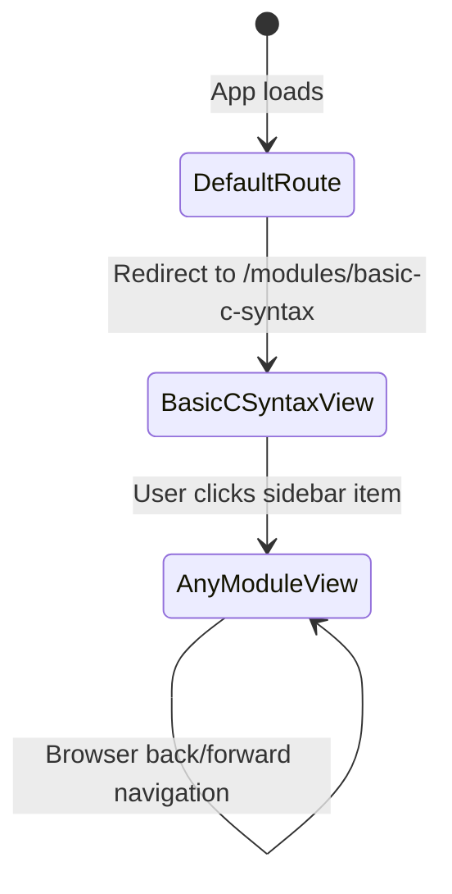
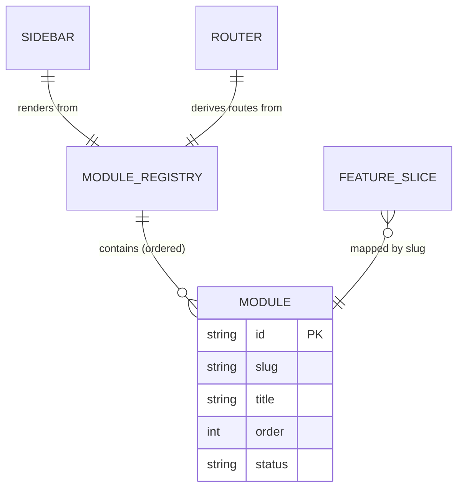

# Data Model: Phase 1 — Init Base with Module Placeholders

**Generated**: 2026-04-18
**Feature**: Phase 1 Init Base with Module Placeholders
**Source**: `entities/module/` FSD layer

---

## Entities

### Module

Represents a single C learning concept. The top-level navigation unit in the sidebar.

```typescript
// src/entities/module/model/module.types.ts

export type ModuleStatus = "available" | "coming-soon";

export interface Module {
  /** Unique identifier and URL slug. Kebab-case. Same value used for both. */
  id: string;
  /** URL-safe path segment. Identical to `id` in Phase 1. */
  slug: string;
  /** Human-readable display name shown in the sidebar and module header. */
  title: string;
  /** 1-based index controlling sidebar render order. Must be unique per module. */
  order: number;
  /**
   * Phase 1: all modules are "available" (renders placeholder panel).
   * Future phases will introduce real content; "coming-soon" can be used
   * for modules not yet implemented.
   */
  status: ModuleStatus;
}

/** Ordered list of all registered C concept modules. */
export type ModuleRegistry = readonly Module[];
```

**Field constraints**:

| Field | Type | Constraints |
|---|---|---|
| `id` | `string` | Kebab-case, unique, non-empty, no spaces |
| `slug` | `string` | Same value as `id` in Phase 1; kebab-case |
| `title` | `string` | Non-empty, Title Case, max 40 characters |
| `order` | `number` | Integer ≥ 1, unique across all modules |
| `status` | `ModuleStatus` | One of `"available"` or `"coming-soon"` |

**Validation rules**:
- `id` and `slug` must be valid URL path segments (no `/`, no `?`, no `#`)
- `order` values must be contiguous starting from 1 (no gaps)
- No two modules may share the same `id`, `slug`, or `order`

---

### ModuleRegistry (constant)

The ordered, read-only list of all 10 C concept modules. Lives in
`src/entities/module/config/modules.ts`. Consumed by the sidebar widget and router.

```typescript
// src/entities/module/config/modules.ts

import type { ModuleRegistry } from "../model/module.types";

export const MODULE_REGISTRY: ModuleRegistry = [
  { id: "basic-c-syntax",  slug: "basic-c-syntax",  title: "Basic C Syntax",      order: 1,  status: "available" },
  { id: "data-types",      slug: "data-types",      title: "Data Types",           order: 2,  status: "available" },
  { id: "input-output",    slug: "input-output",    title: "Input & Output",        order: 3,  status: "available" },
  { id: "functions",       slug: "functions",       title: "Functions",            order: 4,  status: "available" },
  { id: "if-statement",    slug: "if-statement",    title: "If Statements",        order: 5,  status: "available" },
  { id: "for-loop",        slug: "for-loop",        title: "For Loop Statements",  order: 6,  status: "available" },
  { id: "arrays",          slug: "arrays",          title: "Arrays",               order: 7,  status: "available" },
  { id: "strings",         slug: "strings",         title: "Strings",              order: 8,  status: "available" },
  { id: "file-handling",   slug: "file-handling",   title: "File Handling",        order: 9,  status: "available" },
  { id: "examples",        slug: "examples",        title: "Examples",             order: 10, status: "available" },
] as const;
```

---

## State Model

### Navigation State

The currently selected module is managed as client-side router state — the active module
is derived from the URL parameter `:moduleSlug`, not from a React state variable. This
ensures deep-linking works (sharing a URL opens the correct module).

```
URL: /modules/:moduleSlug
           ↓
  Derived: activeModule = MODULE_REGISTRY.find(m => m.slug === moduleSlug)
           ↓
  Sidebar: highlights matching SidebarItem
  Content: renders the matching feature slice's placeholder Page component
```

**State transitions**:



---

## Entity Relationships



---

## Notes on Future Phases

The `Module` entity is intentionally minimal for Phase 1. Future phases should extend it
with:
- `description: string` — short blurb for sidebar tooltip or module header
- `icon?: string` — icon identifier for sidebar item
- `exercises?: ExerciseRef[]` — references to exercises within the module
- `visualizations?: VisualizationRef[]` — references to Mermaid diagrams / animation data

These fields are **not** added now (YAGNI — constitution Principle VI: simplicity).
