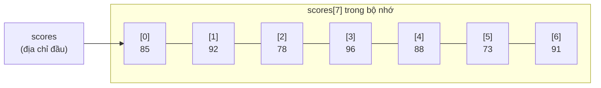

## Là gì?

Mảng (array) là một tập hợp các phần tử có cùng kiểu dữ liệu, được lưu trữ liên tiếp trong bộ nhớ. Mỗi phần tử được truy cập bằng chỉ số (index) bắt đầu từ 0. C hỗ trợ mảng 1 chiều, nhiều chiều, và mảng ký tự (chuỗi). Kích thước mảng phải cố định tại thời điểm khai báo (trừ VLA trong C99).

## Khi nào dùng?

Dùng mảng khi cần lưu trữ nhiều giá trị cùng kiểu và cần truy cập ngẫu nhiên theo chỉ số. Phù hợp cho danh sách điểm, bảng tra cứu, ma trận tính toán. Không phù hợp khi số lượng phần tử thay đổi động — dùng con trỏ + malloc khi đó.

## Dùng như thế nào?

Khai báo: `kiểu tên[kích_thước] = {giá_trị_1, giá_trị_2, ...};`. Truy cập phần tử: `tên[i]`. Duyệt mảng bằng `for` với `i` từ 0 đến `n-1`. Khi truyền mảng vào hàm, C chỉ truyền địa chỉ đầu — phải truyền kèm kích thước.

## Ví dụ code

**Title:** Sắp xếp mảng và tính thống kê
**Language:** c

```c
#include <stdio.h>

void bubbleSort(int arr[], int n) {
    for (int i = 0; i < n - 1; i++) {
        for (int j = 0; j < n - i - 1; j++) {
            if (arr[j] > arr[j + 1]) {
                int temp = arr[j];
                arr[j] = arr[j + 1];
                arr[j + 1] = temp;
            }
        }
    }
}

int main(void) {
    int scores[] = {85, 92, 78, 96, 88, 73, 91};
    int n = 7;

    printf("Truoc khi sap xep: ");
    for (int i = 0; i < n; i++) {
        printf("%d ", scores[i]);
    }
    printf("\n");

    bubbleSort(scores, n);

    printf("Sau khi sap xep:  ");
    for (int i = 0; i < n; i++) {
        printf("%d ", scores[i]);
    }
    printf("\n");
    printf("Min: %d, Max: %d\n", scores[0], scores[n - 1]);

    return 0;
}
```

**Output:**

```text
Truoc khi sap xep: 85 92 78 96 88 73 91
Sau khi sap xep:  73 78 85 88 91 92 96
Min: 73, Max: 96
```

## Sơ đồ

**Title:** Cách mảng lưu trong bộ nhớ



## Hỏi & Đáp

**Q:** Điều gì xảy ra khi truy cập vượt biên mảng (out of bounds)?
C không kiểm tra biên mảng tại runtime. Truy cập arr[7] khi mảng chỉ có 7 phần tử (index 0-6) sẽ đọc/ghi vào vùng nhớ tùy ý — gây ra undefined behavior, có thể crash, dữ liệu sai, hoặc lỗ hổng bảo mật nghiêm trọng. Luôn kiểm tra biên trước khi truy cập.

**Q:** Mảng 2 chiều hoạt động thế nào?
Mảng 2 chiều int matrix[3][4] được lưu liên tiếp trong bộ nhớ theo thứ tự hàng (row-major). matrix[i][j] = *(matrix + i*4 + j). Khai báo: int m[3][4] = {{1,2,3,4}, {5,6,7,8}, {9,10,11,12}};. Khi truyền vào hàm, cần khai báo số cột: void print(int m[][4], int rows).

**Q:** Tại sao khi truyền mảng vào hàm, kích thước bị mất?
Khi truyền mảng vào hàm, C thực ra truyền con trỏ đến phần tử đầu tiên (array decay). Hàm không biết mảng có bao nhiêu phần tử. Do đó, luôn truyền kèm kích thước như tham số thứ hai: void process(int arr[], int n).
