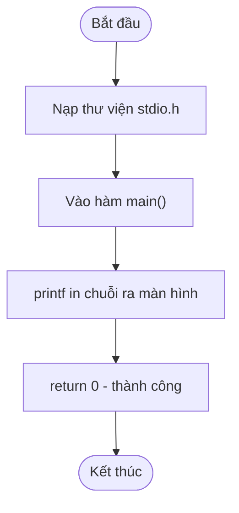

## Là gì?

C là ngôn ngữ lập trình bậc trung, được Dennis Ritchie phát triển vào đầu những năm 1970 tại Bell Labs. Mỗi chương trình C đều có cấu trúc cố định: bắt đầu bằng các chỉ thị tiền xử lý (bắt đầu bằng `#`), tiếp theo là khai báo hàm, và bắt buộc phải có hàm `main()` — điểm khởi chạy của mọi chương trình.

## Khi nào dùng?

Bạn sẽ dùng C khi cần lập trình gần với phần cứng: hệ điều hành, trình điều khiển thiết bị (driver), vi điều khiển, hoặc bất kỳ ứng dụng nào yêu cầu kiểm soát bộ nhớ và hiệu suất tối đa.

## Dùng như thế nào?

Cú pháp C yêu cầu: (1) `#include <stdio.h>` để nhúng thư viện nhập/xuất chuẩn, (2) hàm `main()` trả về `int`, (3) mỗi câu lệnh kết thúc bằng dấu chấm phẩy `;`, và (4) khối lệnh được bao trong cặp ngoặc nhọn `{ }`.

## Ví dụ code

**Title:** Chương trình Hello World
**Language:** c

```c
#include <stdio.h>

int main(void) {
    printf("Hello, World!\n");
    return 0;
}
```

**Output:**

```text
Hello, World!
```

## Sơ đồ

**Title:** Luồng thực thi chương trình Hello World



## Hỏi & Đáp

**Q:** Tại sao hàm main() phải trả về int?
Giá trị trả về của main() được gửi lại cho hệ điều hành. Quy ước: 0 nghĩa là chương trình chạy thành công, khác 0 nghĩa là có lỗi. Điều này cho phép shell script hoặc các công cụ tự động kiểm tra xem chương trình có hoạt động đúng không.

**Q:** \n trong printf() có nghĩa gì?
\n là ký tự xuống dòng (newline). Khi printf() gặp \n, nó di chuyển con trỏ xuống đầu dòng tiếp theo. Nếu không có \n, các lần gọi printf() tiếp theo sẽ in liền trên cùng một dòng.

**Q:** Sự khác biệt giữa int main(void) và int main()?
Trong C, int main() có nghĩa là hàm có thể nhận bất kỳ tham số nào (không xác định), trong khi int main(void) nghĩa là hàm không nhận tham số nào cả. Chuẩn C99 trở lên khuyến nghị dùng void để khai báo rõ ràng hơn.
