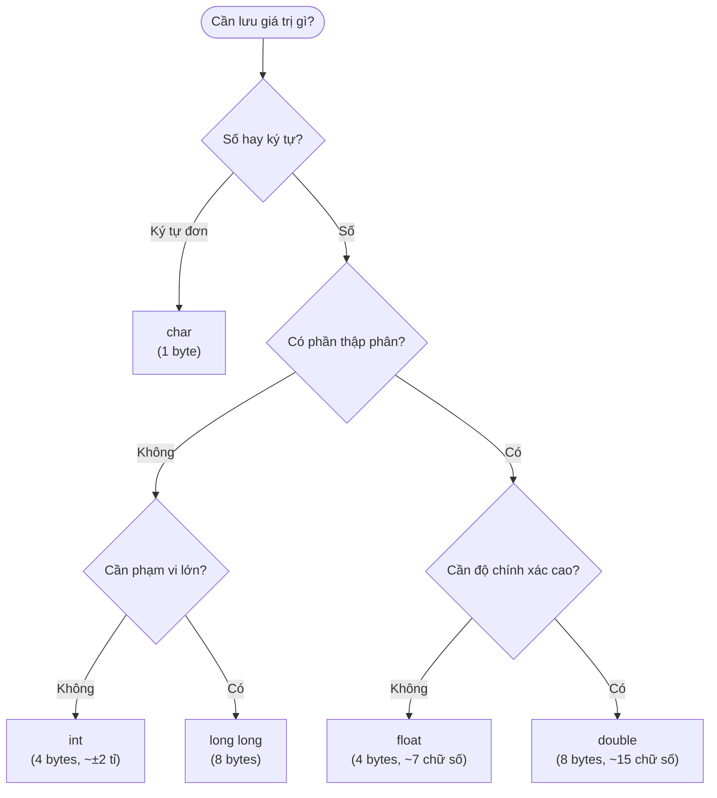

## Là gì?

Kiểu dữ liệu (data type) xác định loại giá trị mà một biến có thể lưu trữ và bộ nhớ cần cấp phát. C cung cấp các kiểu nguyên thuỷ: `int` (số nguyên, 4 byte), `float` (số thực 32-bit), `double` (số thực 64-bit, chính xác hơn), `char` (ký tự, 1 byte), và `void` (không có kiểu).

## Khi nào dùng?

Chọn kiểu dữ liệu phù hợp giúp tiết kiệm bộ nhớ và tránh lỗi tràn số (overflow). Dùng `int` cho bộ đếm và chỉ số mảng; `double` cho tính toán khoa học; `char` cho ký tự đơn; `float` khi bộ nhớ quan trọng hơn độ chính xác.

## Dùng như thế nào?

Khai báo biến theo cú pháp: `kiểu_dữ_liệu tên_biến = giá_trị_khởi_tạo;`. Dùng `printf` với format specifier tương ứng: `%d` cho int, `%f` hay `%.2f` cho float/double, `%c` cho char, `%s` cho chuỗi, `%lu` cho `sizeof` (kiểu `size_t`).

## Ví dụ code

**Title:** Các kiểu dữ liệu cơ bản
**Language:** c

```c
#include <stdio.h>

int main(void) {
    int age = 25;
    float gpa = 3.75f;
    double pi = 3.14159265358979;
    char grade = 'A';

    printf("Tuoi: %d\n", age);
    printf("GPA: %.2f\n", gpa);
    printf("Pi: %.10f\n", pi);
    printf("Hang: %c\n", grade);

    printf("Kich thuoc int: %lu bytes\n", sizeof(int));
    printf("Kich thuoc double: %lu bytes\n", sizeof(double));

    return 0;
}
```

**Output:**

```text
Tuoi: 25
GPA: 3.75
Pi: 3.1415926536
Hang: A
Kich thuoc int: 4 bytes
Kich thuoc double: 8 bytes
```

## Sơ đồ

**Title:** Cách chọn kiểu dữ liệu phù hợp



## Hỏi & Đáp

**Q:** Tại sao nên dùng double thay vì float?
double có độ chính xác khoảng 15–16 chữ số thập phân, trong khi float chỉ có 6–7. Trong hầu hết trường hợp, sự chênh lệch về bộ nhớ (4 vs 8 byte) không đáng kể, nhưng lỗi làm tròn từ float có thể tích lũy và gây ra kết quả sai trong tính toán khoa học hoặc tài chính.

**Q:** Chuyển đổi kiểu dữ liệu (type casting) là gì?
Type casting cho phép chuyển đổi tạm thời một giá trị sang kiểu khác. Ví dụ: (double)5 / 2 = 2.5, nhưng 5 / 2 = 2 (chia nguyên). Cú pháp: (kiểu_mới) biểu_thức. Lưu ý: chuyển từ double sang int sẽ mất phần thập phân.

**Q:** unsigned int khác int ở điểm nào?
int có thể lưu số âm và dương (phạm vi khoảng -2 tỉ đến +2 tỉ), trong khi unsigned int chỉ lưu số không âm (0 đến ~4 tỉ). Dùng unsigned khi biến chắc chắn không bao giờ âm, ví dụ như kích thước mảng hoặc bộ đếm.
