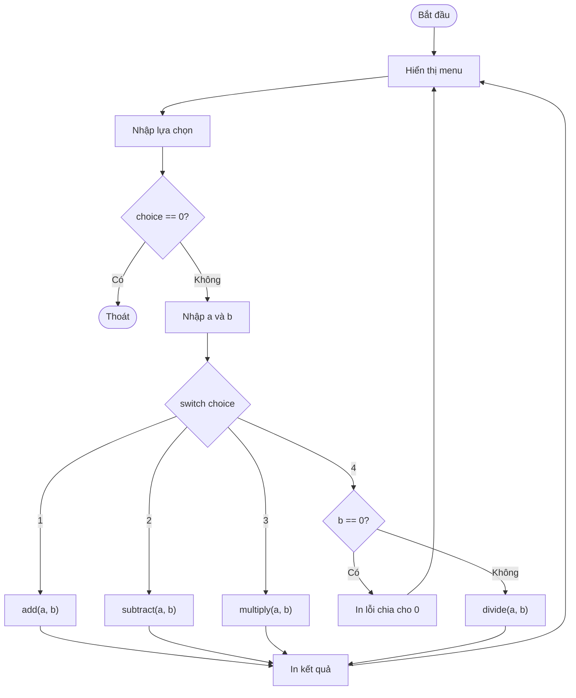

## Là gì?

Đây là ví dụ tổng hợp kết hợp nhiều khái niệm C đã học: hàm, vòng lặp, điều kiện, và kiểu dữ liệu. Chương trình máy tính đơn giản minh họa cách tổ chức code thực tế: chia nhỏ thành các hàm chuyên biệt, dùng vòng lặp do-while cho menu, và xử lý điều kiện biên (chia cho 0).

## Khi nào dùng?

Áp dụng pattern này khi xây dựng ứng dụng console có menu lựa chọn: calculator, game text-based, công cụ quản lý dữ liệu đơn giản. Cấu trúc hàm riêng biệt cho mỗi thao tác giúp code dễ bảo trì và kiểm thử.

## Dùng như thế nào?

Thiết kế top-down: bắt đầu từ hàm `main()` với logic menu chính, sau đó implement từng hàm con. Dùng `do-while` cho menu để luôn hiển thị ít nhất một lần. Dùng `switch` để điều hướng lựa chọn. Tách logic tính toán vào hàm riêng để tái sử dụng và kiểm thử độc lập.

## Ví dụ code

**Title:** Máy tính 4 phép tính cơ bản
**Language:** c

```c
#include <stdio.h>

double add(double a, double b) { return a + b; }
double subtract(double a, double b) { return a - b; }
double multiply(double a, double b) { return a * b; }

int divide(double a, double b, double *result) {
    if (b == 0) return 0;
    *result = a / b;
    return 1;
}

int main(void) {
    double a, b, result;
    int choice;

    do {
        printf("\n=== May Tinh ===\n");
        printf("1. Cong\n2. Tru\n3. Nhan\n4. Chia\n0. Thoat\n");
        printf("Chon: ");
        scanf("%d", &choice);

        if (choice == 0) break;

        printf("Nhap a va b: ");
        scanf("%lf %lf", &a, &b);

        switch (choice) {
            case 1: printf("Ket qua: %.2f\n", add(a, b)); break;
            case 2: printf("Ket qua: %.2f\n", subtract(a, b)); break;
            case 3: printf("Ket qua: %.2f\n", multiply(a, b)); break;
            case 4:
                if (divide(a, b, &result))
                    printf("Ket qua: %.2f\n", result);
                else
                    printf("Loi: Khong the chia cho 0!\n");
                break;
            default: printf("Lua chon khong hop le!\n");
        }
    } while (choice != 0);

    printf("Tam biet!\n");
    return 0;
}
```

**Output:**

```text
=== May Tinh ===
1. Cong
2. Tru
3. Nhan
4. Chia
0. Thoat
Chon: 1
Nhap a va b: 10 3
Ket qua: 13.00
```

## Sơ đồ

**Title:** Luồng hoạt động máy tính



## Hỏi & Đáp

**Q:** Tại sao dùng double thay vì int cho phép tính?
int chỉ lưu số nguyên, nên 7/2 = 3 (mất phần thập phân). double cho phép kết quả chính xác như 7.0/2.0 = 3.5. Với máy tính, người dùng kỳ vọng phép chia cho kết quả số thực, nên double là lựa chọn phù hợp.

**Q:** Tại sao hàm divide() trả về int thay vì double?
Hàm divide() dùng pattern trả về mã lỗi (0 = thất bại, 1 = thành công) và truyền kết quả qua con trỏ double *result. Đây là pattern phổ biến trong C để trả về cả trạng thái lỗi lẫn kết quả. Thay thế hiện đại: trả về NaN hoặc dùng errno.

**Q:** Tại sao dùng do-while thay vì while cho menu?
do-while đảm bảo thân vòng lặp chạy ít nhất một lần trước khi kiểm tra điều kiện. Với menu, ta luôn muốn hiển thị menu trước khi biết người dùng có muốn thoát không. while kiểm tra điều kiện trước, không phù hợp khi cần chạy ít nhất một lần.
