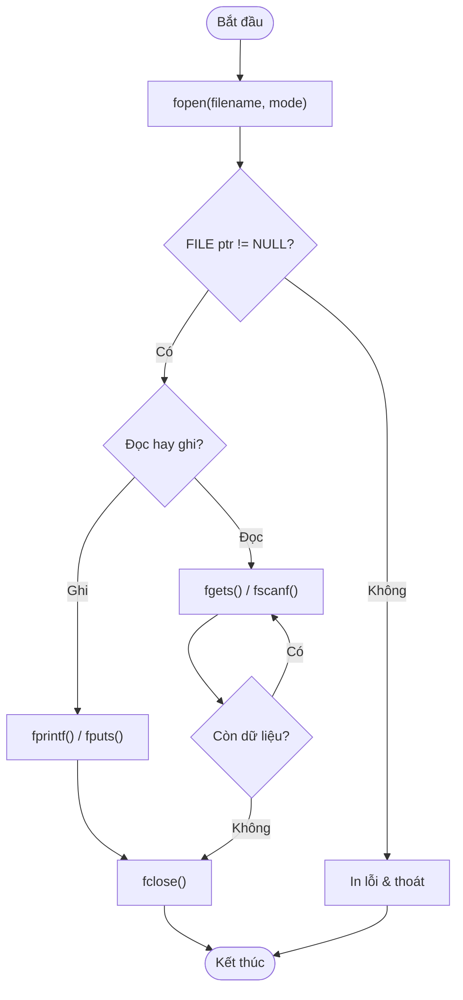

## Là gì?

Xử lý file trong C cho phép chương trình đọc và ghi dữ liệu lên đĩa cứng, giúp dữ liệu tồn tại sau khi chương trình kết thúc. Thư viện `<stdio.h>` cung cấp kiểu `FILE*` (con trỏ file) và các hàm: `fopen()`, `fclose()`, `fprintf()`, `fscanf()`, `fgets()`, `fputs()`. Luôn kiểm tra `NULL` sau `fopen()` và gọi `fclose()` khi xong.

## Khi nào dùng?

Dùng file I/O khi cần: lưu dữ liệu bền vững (điểm số, cấu hình, log), đọc dữ liệu từ file cấu hình, xử lý dữ liệu lớn không vừa RAM, hoặc chia sẻ dữ liệu giữa các lần chạy chương trình.

## Dùng như thế nào?

Quy trình: `fopen()` → kiểm tra NULL → đọc/ghi → `fclose()`. Chế độ mở: `"r"` (đọc), `"w"` (ghi, tạo mới hoặc xóa nội dung cũ), `"a"` (ghi thêm vào cuối), `"r+"` (đọc và ghi). Dùng `fgets()` thay vì `fscanf()` cho chuỗi để tránh tràn bộ đệm.

## Ví dụ code

**Title:** Ghi và đọc điểm sinh viên
**Language:** c

```c
#include <stdio.h>

int main(void) {
    // Ghi file
    FILE *fp = fopen("scores.txt", "w");
    if (fp == NULL) {
        printf("Khong the mo file de ghi!\n");
        return 1;
    }
    fprintf(fp, "An 85\n");
    fprintf(fp, "Binh 92\n");
    fprintf(fp, "Chi 78\n");
    fclose(fp);
    printf("Da ghi file thanh cong.\n");

    // Doc file
    fp = fopen("scores.txt", "r");
    if (fp == NULL) {
        printf("Khong the mo file de doc!\n");
        return 1;
    }
    char line[100];
    printf("Noi dung file:\n");
    while (fgets(line, sizeof(line), fp) != NULL) {
        printf("  %s", line);
    }
    fclose(fp);

    return 0;
}
```

**Output:**

```text
Da ghi file thanh cong.
Noi dung file:
  An 85
  Binh 92
  Chi 78
```

## Sơ đồ

**Title:** Luồng xử lý file



## Hỏi & Đáp

**Q:** Điều gì xảy ra nếu quên gọi fclose()?
Quên fclose() gây rò rỉ tài nguyên (resource leak): dữ liệu ghi chưa được flush (xả bộ đệm) ra đĩa có thể bị mất, số lượng file mở tối đa của hệ điều hành có thể bị vượt (thường 1024). Trong chương trình dài chạy liên tục, điều này dẫn đến lỗi nghiêm trọng.

**Q:** Sự khác biệt giữa chế độ "w" và "a"?
Chế độ "w" (write) tạo file mới hoặc xóa toàn bộ nội dung file cũ trước khi ghi. Chế độ "a" (append) giữ nguyên nội dung cũ và ghi thêm vào cuối file. Dùng "a" cho log file (không muốn mất dữ liệu cũ), dùng "w" khi muốn ghi đè hoàn toàn.

**Q:** fgets an toàn hơn gets như thế nào?
gets() đọc chuỗi cho đến khi gặp newline mà không giới hạn độ dài — dễ gây tràn bộ đệm, bị loại bỏ khỏi C11. fgets(buf, n, fp) chỉ đọc tối đa n-1 ký tự, đảm bảo an toàn bộ đệm. Lưu ý: fgets giữ lại ký tự newline '\n' trong chuỗi nếu đọc đủ dòng.
