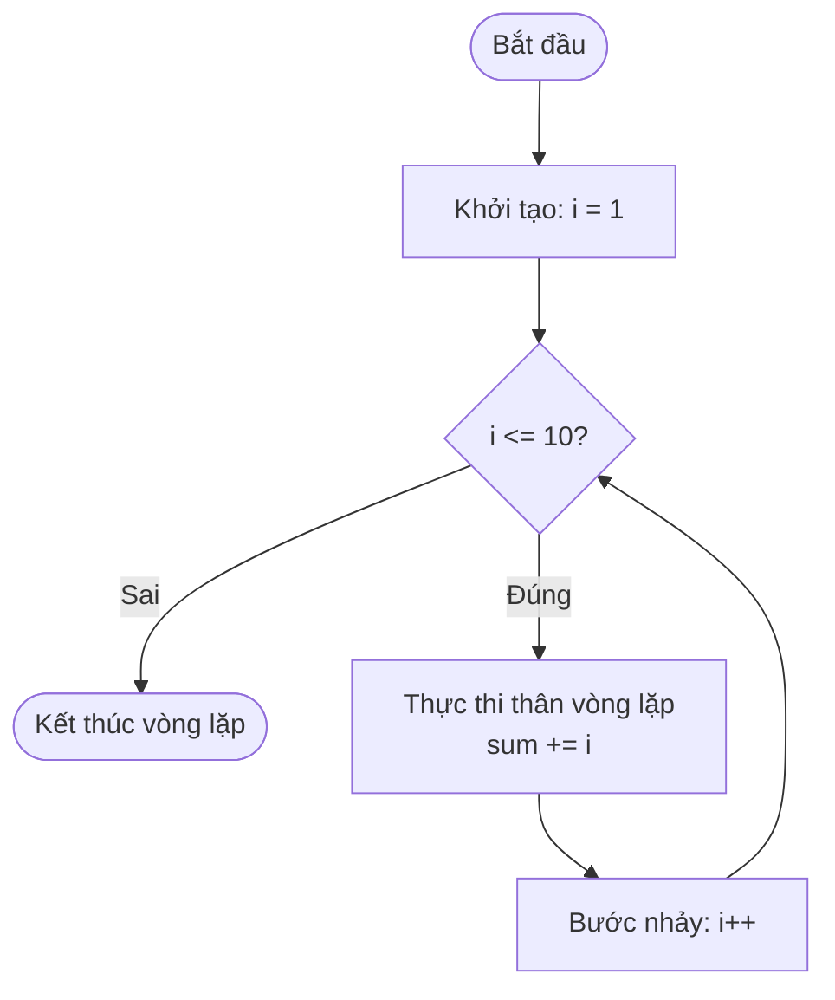

## Là gì?

Vòng lặp `for` cho phép lặp lại một khối code một số lần xác định. Cú pháp gồm 3 phần trong dấu ngoặc đơn: khởi tạo (chạy 1 lần), điều kiện (kiểm tra trước mỗi vòng), và bước nhảy (chạy sau mỗi vòng). C còn có `while` và `do-while` cho các trường hợp số lần lặp chưa biết trước.

## Khi nào dùng?

Dùng `for` khi biết trước số lần lặp hoặc cần duyệt qua mảng/chuỗi với chỉ số. Dùng `while` khi số lần lặp phụ thuộc vào điều kiện động. Dùng `do-while` khi cần thực hiện ít nhất một lần trước khi kiểm tra điều kiện (như menu nhập liệu).

## Dùng như thế nào?

Cú pháp: `for (khởi_tạo; điều_kiện; bước_nhảy) { thân_vòng_lặp }`. Ví dụ: `for (int i = 0; i < 10; i++)`. Dùng `break` để thoát vòng lặp sớm, `continue` để bỏ qua phần còn lại của vòng hiện tại và chuyển sang vòng tiếp theo.

## Ví dụ code

**Title:** Tính tổng và tìm số lớn nhất
**Language:** c

```c
#include <stdio.h>

int main(void) {
    int scores[] = {85, 92, 78, 96, 88, 73, 91};
    int n = 7;
    int sum = 0;
    int max = scores[0];

    for (int i = 0; i < n; i++) {
        sum += scores[i];
        if (scores[i] > max) {
            max = scores[i];
        }
    }

    printf("Tong: %d\n", sum);
    printf("Trung binh: %.2f\n", (double)sum / n);
    printf("Diem cao nhat: %d\n", max);

    return 0;
}
```

**Output:**

```text
Tong: 603
Trung binh: 86.14
Diem cao nhat: 96
```

## Sơ đồ

**Title:** Luồng thực thi vòng lặp for



## Hỏi & Đáp

**Q:** Vòng lặp vô hạn xảy ra khi nào?
Khi điều kiện luôn đúng: for (;;) hoặc while (1). Đây không phải lúc nào cũng lỗi — server và game loop thường dùng vòng lặp vô hạn với break để thoát khi có điều kiện cụ thể. Lỗi phổ biến: quên tăng biến đếm hoặc điều kiện sai hướng (i++ khi cần i--).

**Q:** Vòng lặp lồng nhau (nested loop) có hiệu suất thế nào?
Vòng lặp lồng nhau có độ phức tạp O(n²) hoặc cao hơn. Với n = 1000, vòng lặp lồng 2 tầng thực hiện 1 triệu lần lặp. Nên tránh lồng quá 3 tầng và cân nhắc tách ra thành hàm riêng để code dễ đọc hơn.

**Q:** Khác biệt giữa i++ và ++i trong vòng lặp for?
Trong ngữ cảnh vòng lặp for (bước nhảy), i++ và ++i cho kết quả giống nhau — cả hai đều tăng i thêm 1 sau mỗi vòng. Sự khác biệt chỉ quan trọng khi dùng giá trị của biểu thức: x = i++ gán giá trị cũ cho x, còn x = ++i gán giá trị mới.
