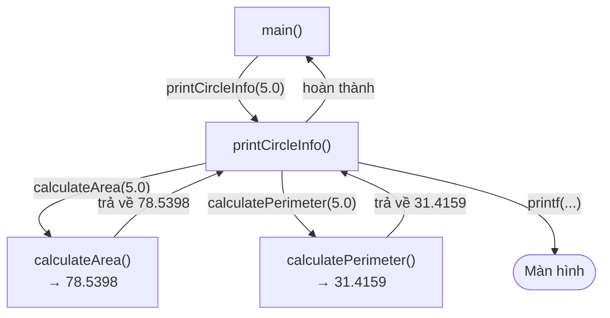

## Là gì?

Hàm (function) là một khối code được đặt tên, có thể tái sử dụng nhiều lần. Hàm giúp chia chương trình lớn thành các phần nhỏ, dễ hiểu và dễ kiểm thử. Trong C, hàm gồm: kiểu trả về, tên hàm, danh sách tham số, và thân hàm. Trước khi dùng một hàm, C yêu cầu phải khai báo prototype (nguyên mẫu).

## Khi nào dùng?

Tạo hàm khi một đoạn code được lặp lại 2 lần trở lên, hoặc khi một tác vụ đủ độc lập để tách ra. Nguyên tắc: mỗi hàm nên chỉ làm một việc (Single Responsibility). Tránh tạo hàm quá dài hơn 50 dòng.

## Dùng như thế nào?

Cú pháp: `kiểu_trả_về tên_hàm(kiểu tham1, kiểu tham2) { ... return giá_trị; }`. Nếu hàm không trả về gì, dùng `void`. Để dùng hàm trước khi định nghĩa, khai báo prototype ở đầu file: `int add(int a, int b);`.

## Ví dụ code

**Title:** Hàm tính diện tích và chu vi hình tròn
**Language:** c

```c
#include <stdio.h>

#define PI 3.14159265

double calculateArea(double radius) {
    return PI * radius * radius;
}

double calculatePerimeter(double radius) {
    return 2.0 * PI * radius;
}

void printCircleInfo(double radius) {
    printf("Ban kinh: %.2f\n", radius);
    printf("Dien tich: %.4f\n", calculateArea(radius));
    printf("Chu vi: %.4f\n", calculatePerimeter(radius));
}

int main(void) {
    printCircleInfo(5.0);
    printCircleInfo(10.0);
    return 0;
}
```

**Output:**

```text
Ban kinh: 5.00
Dien tich: 78.5398
Chu vi: 31.4159
Ban kinh: 10.00
Dien tich: 314.1593
Chu vi: 62.8318
```

## Sơ đồ

**Title:** Luồng gọi hàm



## Hỏi & Đáp

**Q:** Tham số truyền theo giá trị (by value) có nghĩa gì?
Trong C, mặc định tham số được truyền theo giá trị — hàm nhận một bản sao của giá trị, không phải biến gốc. Thay đổi tham số trong hàm không ảnh hưởng đến biến bên ngoài. Để hàm có thể thay đổi biến bên ngoài, cần truyền con trỏ (pointer).

**Q:** Prototype hàm có bắt buộc không?
Không bắt buộc nếu hàm được định nghĩa trước khi dùng. Nhưng prototype là thực hành tốt vì: (1) compiler có thể kiểm tra kiểu tham số ngay khi biên dịch, (2) cho phép tổ chức code linh hoạt hơn, (3) cần thiết khi hàm được định nghĩa trong file khác.

**Q:** Hàm đệ quy (recursive) là gì?
Hàm đệ quy là hàm tự gọi chính nó. Ví dụ: tính giai thừa factorial(n) = n * factorial(n-1). Yêu cầu bắt buộc: phải có điều kiện dừng (base case) để tránh vòng lặp vô hạn và tràn stack.
