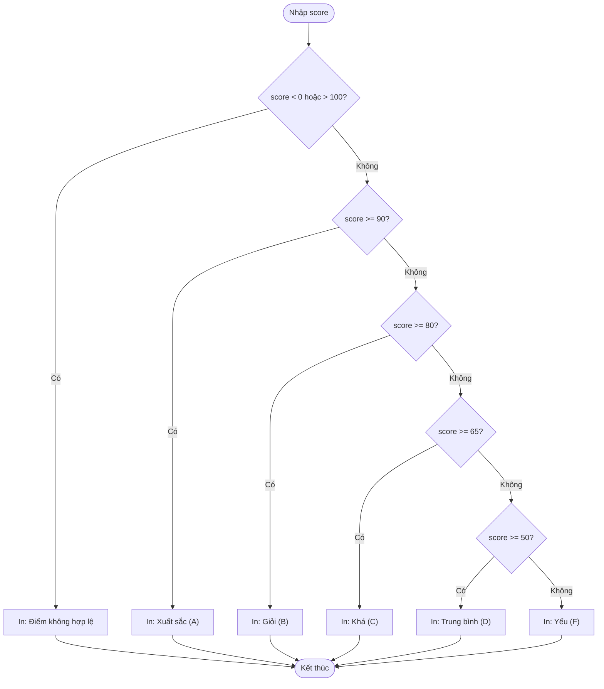

## Là gì?

Câu lệnh điều kiện `if` cho phép chương trình thực thi các khối code khác nhau dựa trên điều kiện Boolean. C hỗ trợ: `if`, `else`, `else if` (chuỗi điều kiện), và `switch` (so sánh nhiều giá trị hằng). Điều kiện là bất kỳ biểu thức nào có giá trị khác 0 (truthy) hoặc bằng 0 (falsy).

## Khi nào dùng?

Dùng `if/else` cho điều kiện phức tạp với biểu thức so sánh, phạm vi giá trị. Dùng `switch` khi so sánh một biến với nhiều giá trị hằng số nguyên — code sạch hơn và đôi khi nhanh hơn chuỗi `else if`. Luôn thêm `default` trong switch để xử lý trường hợp không khớp.

## Dùng như thế nào?

Cú pháp `if`: `if (điều_kiện) { ... } else if (điều_kiện_2) { ... } else { ... }`. Toán tử so sánh: `==` (bằng), `!=` (khác), `<`, `>`, `<=`, `>=`. Toán tử logic: `&&` (và), `||` (hoặc), `!` (phủ định).

## Ví dụ code

**Title:** Phân loại điểm thi
**Language:** c

```c
#include <stdio.h>

void classifyScore(int score) {
    if (score < 0 || score > 100) {
        printf("Diem khong hop le!\n");
    } else if (score >= 90) {
        printf("Xuat sac (A)\n");
    } else if (score >= 80) {
        printf("Gioi (B)\n");
    } else if (score >= 65) {
        printf("Kha (C)\n");
    } else if (score >= 50) {
        printf("Trung binh (D)\n");
    } else {
        printf("Yeu (F)\n");
    }
}

int main(void) {
    classifyScore(95);
    classifyScore(73);
    classifyScore(45);
    classifyScore(-5);
    return 0;
}
```

**Output:**

```text
Xuat sac (A)
Kha (C)
Yeu (F)
Diem khong hop le!
```

## Sơ đồ

**Title:** Luồng phân loại điểm



## Hỏi & Đáp

**Q:** Tại sao so sánh bằng phải dùng == thay vì =?
= là toán tử gán (assignment), còn == là toán tử so sánh bằng (equality). Viết if (x = 5) sẽ gán 5 vào x và luôn đúng (vì 5 != 0), đây là lỗi logic rất phổ biến. Một số lập trình viên viết if (5 == x) để compiler báo lỗi nếu vô tình dùng = thay vì ==.

**Q:** Khi nào nên dùng switch thay vì if-else?
Dùng switch khi so sánh một biến với nhiều giá trị hằng số (thường là int hoặc char). switch thường dễ đọc hơn chuỗi else-if dài. Lưu ý: switch không hỗ trợ so sánh phạm vi (như >= 90) hay điều kiện phức tạp — những trường hợp đó phải dùng if-else.

**Q:** Toán tử ba ngôi (ternary operator) là gì?
Cú pháp: điều_kiện ? giá_trị_nếu_đúng : giá_trị_nếu_sai. Ví dụ: max = (a > b) ? a : b; Ưu điểm: ngắn gọn cho các phép gán đơn giản. Nhược điểm: khó đọc nếu lồng nhau nhiều tầng.
