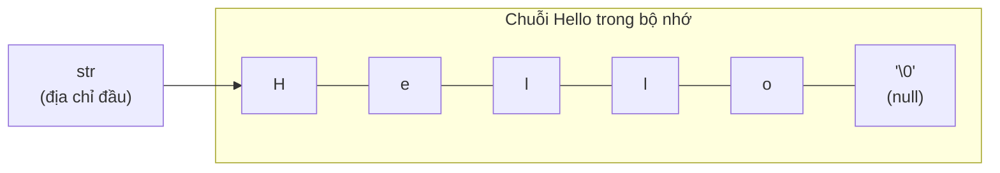

## Là gì?

Trong C, chuỗi (string) là mảng ký tự (`char[]`) kết thúc bằng ký tự null `'\0'`. Không có kiểu `string` riêng như trong C++ hay Java. Thư viện `<string.h>` cung cấp các hàm thao tác chuỗi: `strlen()`, `strcpy()`, `strncpy()`, `strcat()`, `strcmp()`. Mọi thao tác đều dựa trên quy ước chuỗi kết thúc bởi `'\0'`.

## Khi nào dùng?

Dùng `char[]` khi cần lưu trữ và thao tác văn bản trong C. Dùng `strlen()` để lấy độ dài, `strcpy()`/`strncpy()` để sao chép, `strcat()` để nối chuỗi, `strcmp()` để so sánh. Luôn ưu tiên các hàm có giới hạn độ dài (`strncpy`, `strncat`, `snprintf`) để tránh tràn bộ đệm.

## Dùng như thế nào?

Khai báo: `char str[50] = "Hello";` hoặc `char str[] = "Hello";` (compiler tự tính kích thước). Kích thước mảng phải đủ lớn để chứa cả ký tự `'\0'` ở cuối. Không dùng `=` để gán chuỗi sau khi khai báo — phải dùng `strcpy()`. Không dùng `==` để so sánh — phải dùng `strcmp()`.

## Ví dụ code

**Title:** Thao tác cơ bản với chuỗi
**Language:** c

```c
#include <stdio.h>
#include <string.h>

int main(void) {
    char first[50] = "Hello";
    char last[] = "World";
    char full[100];

    strncpy(full, first, sizeof(full) - 1);
    full[sizeof(full) - 1] = '\0';

    strncat(full, " ", sizeof(full) - strlen(full) - 1);
    strncat(full, last, sizeof(full) - strlen(full) - 1);

    printf("Chuoi: %s\n", full);
    printf("Do dai: %lu\n", strlen(full));

    if (strcmp(first, "Hello") == 0) {
        printf("first bang 'Hello'\n");
    }

    for (int i = 0; full[i] != '\0'; i++) {
        if (full[i] == 'l') {
            full[i] = 'L';
        }
    }
    printf("Sau khi thay the: %s\n", full);

    return 0;
}
```

**Output:**

```text
Chuoi: Hello World
Do dai: 11
first bang 'Hello'
Sau khi thay the: HeLLo WorLd
```

## Sơ đồ

**Title:** Chuỗi C trong bộ nhớ



## Hỏi & Đáp

**Q:** Tại sao không dùng == để so sánh hai chuỗi?
== so sánh địa chỉ bộ nhớ (con trỏ), không phải nội dung. Hai chuỗi có nội dung giống nhau nhưng ở vùng nhớ khác nhau sẽ cho kết quả false với ==. Dùng strcmp(s1, s2) == 0 để so sánh nội dung — hàm này duyệt từng ký tự cho đến '\0'.

**Q:** Tại sao strncpy an toàn hơn strcpy?
strcpy không kiểm tra giới hạn bộ đệm đích, có thể gây tràn bộ đệm (buffer overflow) nếu chuỗi nguồn dài hơn bộ đệm đích. strncpy(dest, src, n) chỉ sao chép tối đa n ký tự. Lưu ý: strncpy không đảm bảo thêm '\0' cuối nếu chuỗi nguồn dài đúng n ký tự — phải thêm thủ công.

**Q:** String literal trong C có thể thay đổi không?
String literal như "Hello" được lưu trong vùng nhớ read-only. Dùng char *s = "Hello"; rồi s[0] = 'h'; là undefined behavior (thường gây crash). Để có chuỗi thay đổi được, dùng char s[] = "Hello"; — compiler sao chép dữ liệu vào mảng trên stack.
